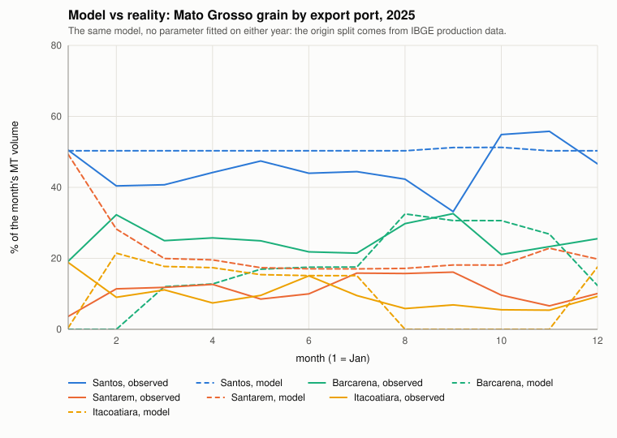
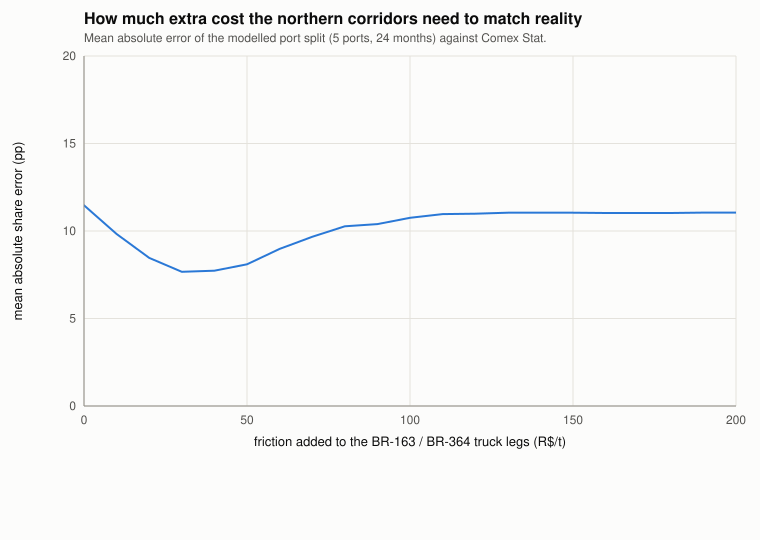
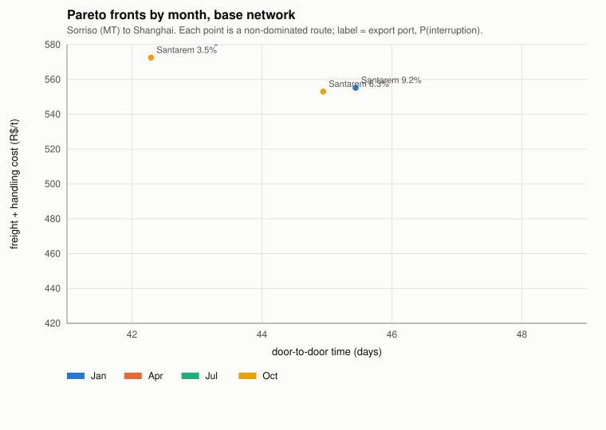
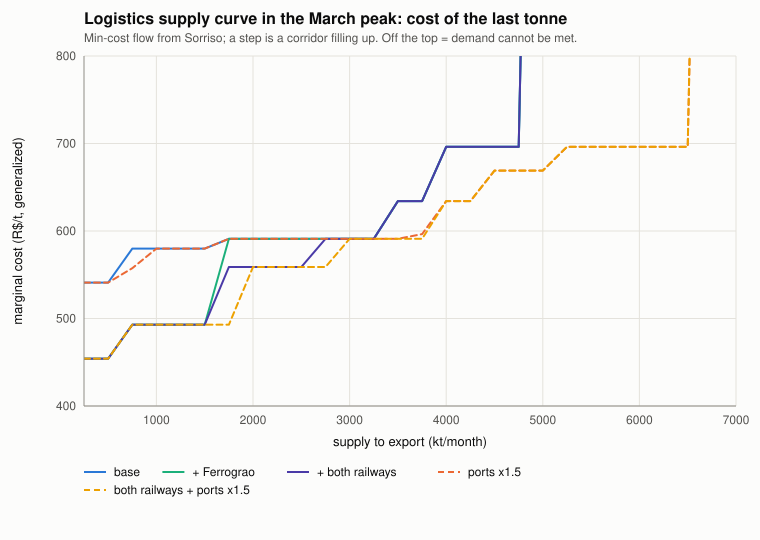
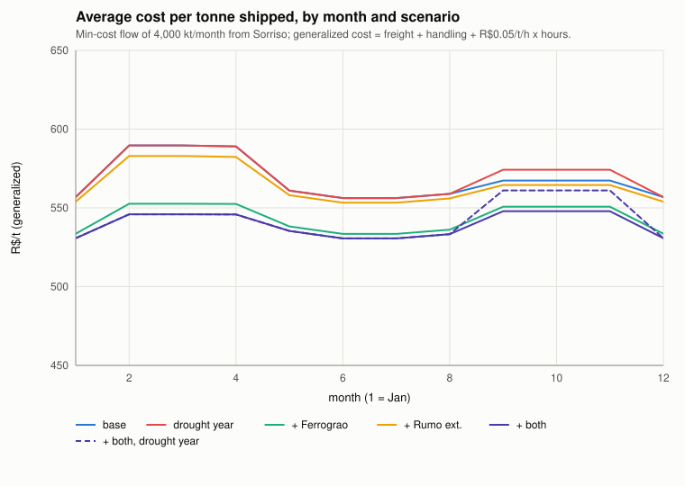
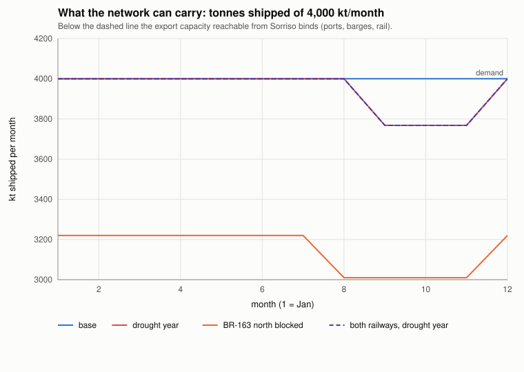
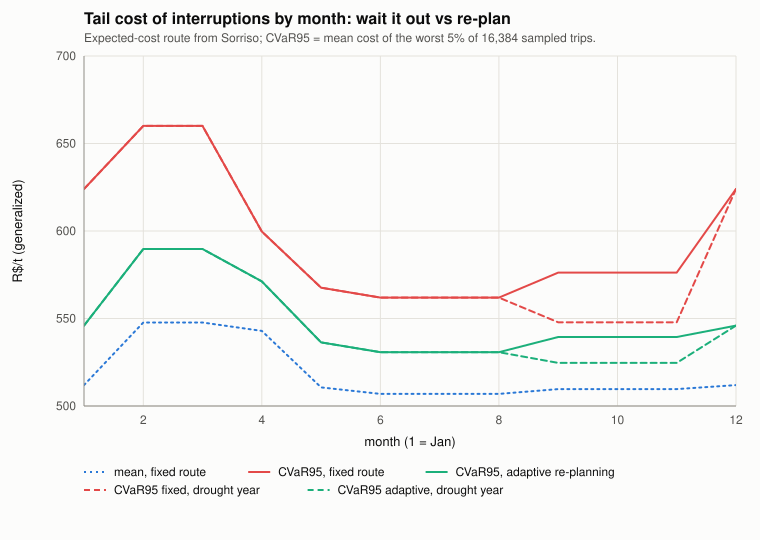
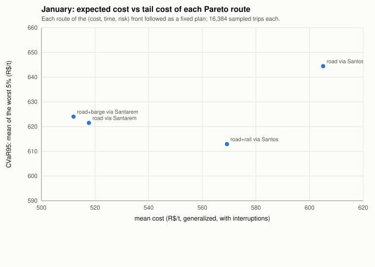

# Multimodal grain logistics in Brazil, in Bend 2

A reproducible study of one question:

> How should soybean from Mato Grosso reach an export ship when the routes
> (truck, rail, barge, ship) trade off **cost, time and interruption risk**, and
> capacity, seasons (harvest peaks, low water) and blockades change by month?

Everything is written in **pure [Bend 2](https://github.com/bendlang/bend)**:
network, algorithms, Monte Carlo, tests and the SVG plotting.

Tariffs, distances, seasonality, ocean freight per port, terminal capacities and
monthly volumes are calibrated against **USDA AgTransport** and **Comex Stat**;
interruption probabilities are not (`docs/data-sources.md`).

**Short answer:**

1. There is **no algorithmic novelty to claim**: at this scale exact textbook
   methods (Pareto label correcting, min-cost flow, Monte Carlo + CVaR) solve
   every case in milliseconds. A structured search (~2,450 records screened, 35
   papers, all DOIs verified — [`docs/litsearch/`](docs/litsearch)) found no work
   combining the three layers, but multi-objective + CVaR on soybean flows
   (Marto et al. 2026), stochastic recourse in a Brazilian soybean chain (Reis et
   al. 2023) and re-routing after disruption in the Brazilian network (L'Her et al.
   2024) all exist. What survives as new is **seasonal capacity inside the
   optimization**, coupled to the front and to recourse, on the MT corridors.
2. **The least-cost allocation does not reproduce reality, and origin geography
   is most of the gap.** Fed the volume MT actually exported each month of
   2024–2025, a single-origin model's port split is off by **11 percentage points**
   of market share. Splitting the state into three origin regions, weighted by IBGE
   municipal production, brings it to **7.4 pp with no fitted parameter at all**
   (6.9 pp if the split is fitted instead). Part of what survives is Itaqui: at
   ANTT's published tariff ceiling the Ferrovia Norte-Sul lands R$80/t above Santos
   for eastern MT, so the model sends it nothing while reality sends it 5–7%.
3. **Railways lower the average cost, not the marginal cost and not the ceiling.**
   Ferrogrão cuts the average by 7–8% and fills its own capacity, while the last
   tonne still costs the same and the maximum exportable volume does not move;
   only terminal capacity moves it. With calibrated capacities a drought year
   **re-routes** cargo south at a higher price instead of stranding it — the
   opposite of what the uncalibrated model said.
4. **Re-planning at a failure** cuts the tail cost (CVaR95) by 3–10% at almost
   no change in the mean; choosing a "safer" route buys much less.
5. The Monte Carlo is a tree of Bend parallel calls: **5.1× on 8 threads** (M2)
   with identical results.

Full report with tags (KNOWN / VALIDATED / MODEL / SPECULATIVE):
[`docs/results.md`](docs/results.md). Read [`docs/assumptions.md`](docs/assumptions.md) first.

## Contents

```
docs/
  model.md               graph, the three layers, correctness arguments
  assumptions.md         everything that is stylized or missing
  data-sources.md        sourced ranges (with confidence tags) and the value used for each parameter
  literature-review.md   what is known, and where a contribution could sit
  litsearch/             the search log and the coverage matrix behind it
  results.md             results, each tagged
src/
  graph.bend             arcs and list helpers
  params.bend            every per-mode number (rates, speeds, risks, delays, costs)
  season.bend            seasonal effects as composable bitmask factors
  network.bend           23 nodes, 30 legs, scenarios (Ferrograo, Rumo ext., drought, blockades, terminal scale)
  pareto.bend            multi-objective (cost, time, risk) label correcting
  sp.bend                Bellman-Ford shortest path on a weighted sum
  flow.bend              min-cost flow by successive shortest paths + optimality certificate
  risk.bend              interruptions: stateless RNG, fixed vs adaptive policies, parallel scenario tree, CVaR
  brute.bend             exhaustive path enumeration (test oracle)
  observed.bend          MT exports by port and month (Comex Stat), the validation target
  report.bend, svg.bend, io.bend, num.bend   formatting, charts, files
simulations/             validation, fronts, seasonal, capacity, disruption, bench
tests/tests.bend         42 checks
scripts/bench.sh         native build + thread scaling
results/                 generated CSV and SVG
```

## Run

```bash
curl -fsSL https://bend-lang.com/install.sh | sh   # Bend 2 (tested with 2.0.25)
make test      # 42 checks, ~2 s  -> "All checks passed."
make figures   # regenerates results/, ~4 min on an M2 (the origin-split grid dominates)
make bench     # native build, 1/2/4/8 threads (needs clang >= 14; see Makefile)
```

## Key figures

| | |
|---|---|
|  |  |
| Model (dashed) vs Comex Stat (solid): the least-cost split over-uses the north. | How much friction the northern corridors need before the split fits: R$30/t, and 8.6 pp of error survives. |
|  |  |
| Pareto fronts: southern routes enter only in the rainy season, as the low-risk options. | Logistics supply curve: railways shift the start, terminals set the ceiling. |
|  |  |
| Average cost by month and scenario. | Drought and BR-163 blockade: what cannot be shipped. |
|  |  |
| Tail cost: waiting vs re-planning. | Each Pareto route's mean vs CVaR95 (January). |

Also: `ports_base.svg`, `ports_drought.svg`, `supply_curve_average.svg`.
